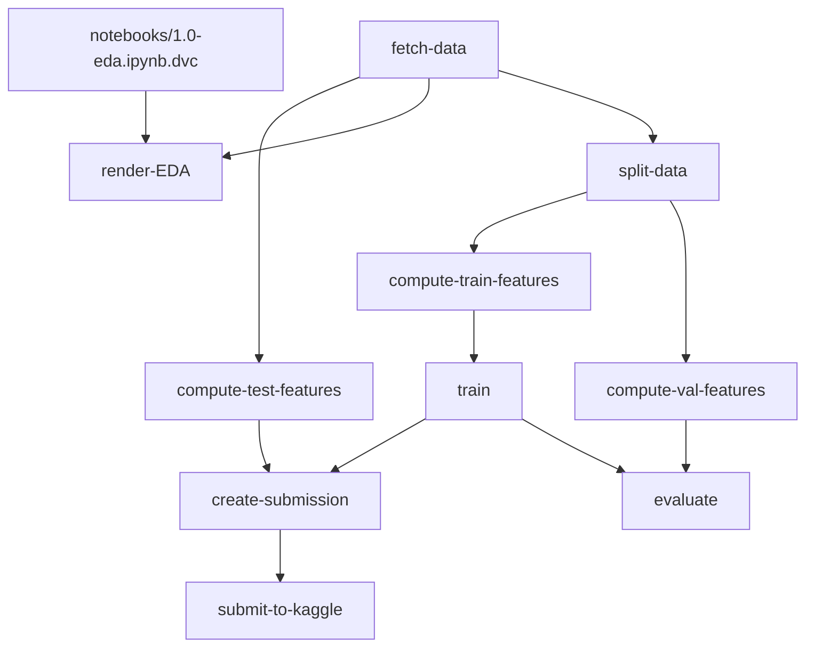

# spaceship-titanic

```mermaid
flowchart TD
	node1["compute-test-features"]
	node2["compute-train-features"]
	node3["compute-val-features"]
	node4["create-submission"]
	node5["evaluate"]
	node6["fetch-data"]
	node7["notebooks/1.0-eda.ipynb.dvc"]
	node8["render-EDA"]
	node9["split-data"]
	node10["submit-to-kaggle"]
	node11["train"]
	node1-->node4
	node2-->node11
	node3-->node5
	node4-->node10
	node6-->node1
	node6-->node8
	node6-->node9
	node7-->node8
	node9-->node2
	node9-->node3
	node11-->node4
	node11-->node5
```
